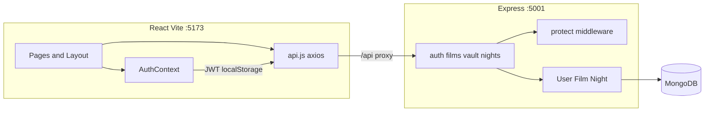

<div class="titlepage">

<p class="eyebrow">Personal rule book</p>

<h1>A one-person rule book — reading unknown code and shipping products</h1>

<p class="subtitle">Worked example: Noir Cinema Club (MERN)</p>

<div class="gold-rule"></div>

<p class="blurb">Written for Avinash, who is learning the MERN stack for the first time. The goal is not to memorize this repository. The goal is a method you can reuse at a company, then enough ownership of this app that routine changes do not require an LLM.</p>

<p class="meta">September 2026 · Print me · Keep me next to the laptop</p>

</div>

# Part 0 — How to use this book

Print this PDF or keep it open beside the editor. It is a working method, not a novel. Read it once for the shape of the argument. Then do **one pass** on Noir Cinema Club this week with the app running.

Do not try to memorize every line. Large codebases are mapped, not stored. After the pass you should be able to draw the request path for register, save-a-film, and host-a-night, name the files involved, and change one of those paths without guessing.

How to work through the week:

1. Run the app. Click like a member. Write down screens and buttons.
2. Read Part 2 and follow the eight steps on this repo.
3. Trace the three worked paths in Part 3 with the files open.
4. Fill the one-page personal map at the end of Part 3.
5. Do one small change without an LLM (copy, empty state, or a field).

If a section feels obvious, skip ahead to the traces. If a trace feels foggy, stop and grep. The method is the product.

Rebuild note: the Markdown in this folder is the source. A print CSS (`rulebook-print.css`) sits beside it. Pandoc to HTML, then Chrome headless print-to-PDF, produced the file you are reading.

# Part 1 — Mindset for unknown codebases

You will never hold millions of lines in your head. Nobody does. Seniors do not win by memory. They keep a **map**: where the program starts, where data lives, how a request travels, and who owns which layer. When something breaks, they walk the map instead of opening files at random.

A first-time MERN learner often feels behind because the repo looks like a wall of filenames. That feeling is normal. The wall is not the unit of understanding. The **path** is: one user intention, from click to database and back.

## Shallow versus comprehensive

Shallow familiarity is “I have seen this file.” Comprehensive understanding is four tests you can apply to yourself:

1. You can **draw** the request path on paper (browser → client function → URL → server route → model → response → UI state).
2. You can **name the files** on that path without scrolling the tree.
3. You can **predict where a bug lives** from the symptom (wrong data on screen, 401, empty list, crash on submit).
4. You can **change it without fear**: a small, reversible edit, then you run the same path and see the result.

If you cannot do those four things for a feature, you do not own it yet. That is not a moral failure. It is a signal to trace one more time.

## How not to start

Do not start at file 1, line 1. Source order is for the compiler, not for your brain.

Do not “open every file.” That produces fatigue and a false sense of coverage. You will remember colors and component names, not cause and effect.

Do not dive into `node_modules`, generated CSS, or lockfiles. Those are dependencies and build output. They are not the product.

Start from **running behavior**. The app, used as a person would use it, is the ground truth. Code is the explanation of that behavior.

<div class="callout">

**Rule you can say out loud:** I map first. I memorize almost nothing. I go deep only on the path I am about to change.

</div>

<div class="pagebreak"></div>

# Part 2 — Rule of thumb: 8-step reading method

This method works on Noir Cinema Club and on a company codebase you have never seen. The steps stay the same. Only the filenames change.

## The eight steps

**1. Run it. Click like a user. Write down screens and buttons.**

A repo that will not boot is a setup problem, not a reading problem. Get a browser window. Click every obvious control. Keep a scratch list: Home, Vault, dossier, Request membership, Sign in, Save to my list, My list, Host a night, Cancel, Sign out. That list is your first path inventory. You built it from reality, not from hope.

**2. Find the front door.**

Look for README, `package.json`, `docker-compose`, `index.js` / `main`, `App.jsx`. In this repo the front doors are:

| Layer | Front door |
| --- | --- |
| Human instructions | `README.md` |
| How to start both processes | root `package.json` (`npm run dev`, `npm run seed`) |
| React boot | `client/src/main.jsx` → `client/src/App.jsx` |
| API boot | `server/src/index.js` |
| Database URI | `server/src/config/db.js` plus `server/.env` (never committed) |

**3. Draw the runtime.**

Before you read handlers, know what is alive when you click. For this product:

```
  Browser (Vite, :5173)
       |  HTTP /api  (dev proxy in vite.config.js)
       v
  Express API (:5001)
       |  mongoose
       v
  MongoDB (MONGO_URI)
```

Environment variables matter because missing `MONGO_URI` or `JWT_SECRET` will look like “the app is broken” when the code is fine. Note them on the drawing.

**4. Pick one vertical slice. Trace it end to end before a second path.**

A vertical slice is one user path: register, or save a film, or host a night. Do not start three at once. The first complete trace teaches you the shape of every later trace.

**5. For that path, walk the hops in order.**

UI event → client function → HTTP URL → server route → model / DB → response → UI state.

If you skip a hop, you will “understand” the page and still be lost when the network fails. Write the hops down. Part 3 does this for three paths with real filenames.

**6. Only then read helpers.**

Auth, middleware, shared layout, and the HTTP client sit on **every** path. If you read them first, they have no story. If you read them after one slice, they snap into place: `client/src/api.js` attaches the bearer token; `server/src/middleware/auth.js` checks it; `ProtectedRoute.jsx` sends guests to login; `Layout.jsx` is the chrome around every page.

**7. Repeat for three to five core paths.**

After a handful of complete traces, new files feel familiar. You start recognizing “this is another form that posts JSON” instead of “this is an unknown universe.” For Noir Cinema Club, three core paths plus session restore is enough to own the product.

**8. Keep a personal map: one page.**

Routes, models, and a short list of “if I change X, Y breaks.” Update it when you learn something. Do not let the map live only in a chat history.

## Rules that sit beside the eight steps

**Breadth first for structure, depth first for the path you are changing.** Spend a short time listing routes and collections. Spend a long time on the one path in front of you.

**Read for intent, not every line of CSS first.** Names, types, status codes, and tests (when they exist) tell you what the author meant. Token files and spacing come after the path is clear. In this repo, `client/src/index.css` is the design token file. It is worth a skim once you know the pages, not before you know register.

**Search (grep) for route strings, model names, and unique copy from the UI.** If the button says “Become a member,” search that string. If the URL is `/api/vault`, search `vault`. Unique English is a better handle than a generic word like `user`.

**When stuck: reproduce the bug, then grep the error message, the API path, or the button label.** Do not start by rereading the entire model. Start from the evidence in front of you.

<div class="callout">

**Company translation:** At work the front door may be a monorepo README, a Helm chart, or an internal portal. The eight steps do not change. Run a slice, find the process that serves it, draw the runtime, trace one path, then read shared middleware.

</div>

<div class="pagebreak"></div>

# Part 3 — Paths versus files

This is the question underneath most first-week panic: *Do I identify the paths, or do I go file by file until I have seen everything?*

**Identify paths by using the app and reading the routers.** On the client, that is the `<Routes>` list in `client/src/App.jsx`. On the server, that is the `app.use` mounts in `server/src/index.js` plus the `router.get` / `router.post` / `router.delete` lines in each route file. That combined list **is** the path inventory. Files are how the paths are implemented. They are not a second, competing checklist.

## How you know you found them all

Two completeness checks:

1. Every `<Route path=...>` in `App.jsx` is on your list (including nested paths like `/films/:slug`).
2. Every `app.use('/api/...')` in `index.js` is on your list, and you have opened each router to list the verbs.

Then walk the UI. If a button exists, it is a path or a **branch** of a path (save versus remove is one endpoint that toggles). If the UI can send you somewhere with no matching route, you found a bug, not a secret path.

Understanding strategy: **path-first**, not line-by-line every file. After a path is clear, skim remaining files for leftovers: CSS tokens, seed data, config, README caveats. Line-by-line reading is for the roughly 20% of files on the path you will change. Reading every line of `node_modules` or generated CSS is waste.

## All user paths in Noir Cinema Club

### Public (no account)

| Path | Screen | Client | Typical API |
| --- | --- | --- | --- |
| Home | Landing, featured film, three collection rows | `client/src/pages/Home.jsx` | `GET /api/films` |
| Browse vault | Full catalog | `client/src/pages/Films.jsx` | `GET /api/films` |
| Filter / search films | Collection chips + search box | same `Films.jsx` | `GET /api/films?collection=&q=` |
| Film dossier | Title page for one film | `client/src/pages/FilmDetail.jsx` | `GET /api/films/:slug` |
| Register | “Join the salon” | `client/src/pages/Register.jsx` | `POST /api/auth/register` |
| Login | “Sign in” | `client/src/pages/Login.jsx` | `POST /api/auth/login` |

`FilmCard` (`client/src/components/FilmCard.jsx`) is not its own route. It is a door into the dossier: it links to `/films/:slug`.

### Member (account required)

| Path | Screen | Client | Typical API |
| --- | --- | --- | --- |
| Save / remove vault | Button on the dossier | `FilmDetail.jsx` `toggleVault` | `POST /api/vault/:filmId` |
| My list | Private grid | `client/src/pages/MyVault.jsx` | `GET /api/vault` |
| Create night | “Host a night” form | `client/src/pages/Nights.jsx` | `POST /api/nights` |
| List nights | Calendar column | same `Nights.jsx` | `GET /api/nights` |
| Cancel night | “Cancel” on a card | same `Nights.jsx` `remove` | `DELETE /api/nights/:id` |
| Logout | “Sign out” in the header | `Layout.jsx` → `AuthContext.logout` | none (clears `localStorage`) |

Nights also loads `GET /api/films` so the film dropdown has titles. That is a supporting request, not a separate product path.

### Cross-cutting (not a page, but a path)

| Path | What you notice | Files |
| --- | --- | --- |
| Protected redirect to login | Guest hits `/my-vault` or `/nights` | `client/src/components/ProtectedRoute.jsx` → `<Navigate to="/login">` |
| Session restore | Refresh while logged in; header still shows your name | `AuthContext.jsx` on mount: `GET /api/auth/me` |
| Health | Ops / sanity check | `GET /api/health` in `server/src/index.js` |

### Client route inventory (`App.jsx`)

```
/                 Home
/films            Films
/films/:slug      FilmDetail
/login            Login
/register         Register
/my-vault         MyVault   (wrapped in ProtectedRoute)
/nights           Nights    (wrapped in ProtectedRoute)
```

All of those sit inside `Layout`, so the header and footer wrap every page.

### Server mount inventory (`server/src/index.js`)

```
GET  /api/health
     /api/auth    → server/src/routes/auth.js
     /api/films   → server/src/routes/films.js
     /api/vault   → server/src/routes/vault.js
     /api/nights  → server/src/routes/nights.js
```

Open those four routers and you have the full HTTP surface:

| HTTP | Handler file |
| --- | --- |
| `POST /api/auth/register` | `auth.js` |
| `POST /api/auth/login` | `auth.js` |
| `GET /api/auth/me` | `auth.js` (uses `protect`) |
| `GET /api/films` | `films.js` |
| `GET /api/films/:slug` | `films.js` |
| `GET /api/vault` | `vault.js` (all vault routes use `protect`) |
| `POST /api/vault/:filmId` | `vault.js` (toggle save / remove) |
| `GET /api/nights` | `nights.js` |
| `POST /api/nights` | `nights.js` |
| `DELETE /api/nights/:id` | `nights.js` |

If you ever wonder “is there another API?”, grep `app.use` and `router.` under `server/src`. That is the discovery method at a company too: React Router list plus Express routers.

## Worked trace A — Register

Goal: a guest becomes a member and lands in the vault.

**User-visible start.** Home (`Home.jsx`) has “Request membership,” which links to `/register`. The register page heading is “Join the salon.” The submit button copy is “Become a member.”

**Hops, in order:**

1. **UI event.** Submit on the form in `client/src/pages/Register.jsx` (`onSubmit`). The form fields are `name`, `email`, `password` (minimum 8 characters in the input).
2. **Client function.** `onSubmit` calls `register(form.name, form.email, form.password)` from `useAuth()`.
3. **Auth implementation.** `register` lives in `client/src/context/AuthContext.jsx`. It posts JSON and, on success, writes the token and user into memory.
4. **HTTP client.** `client/src/api.js` is an axios instance with `baseURL: '/api'`. The call is `api.post('/auth/register', { name, email, password })`, which becomes **`POST /api/auth/register`**. If a token already existed, the request interceptor would attach `Authorization: Bearer …`. For a first registration it usually does not.
5. **Dev proxy.** `client/vite.config.js` forwards `/api` to `http://127.0.0.1:5001`. The browser still thinks it is talking to the same origin as the Vite app (`:5173`). That is why you do not see `:5001` in the address bar.
6. **Server front door.** `server/src/index.js` loads env, connects Mongo via `server/src/config/db.js`, and mounts `app.use('/api/auth', require('./routes/auth'))`.
7. **Route handler.** `server/src/routes/auth.js`, `router.post('/register', ...)`. It validates name/email/password, rejects short passwords, rejects a duplicate email (`409`), then `User.create`.
8. **Model / Mongo.** `server/src/models/User.js`. On save, a `pre('save')` hook hashes the password with bcrypt. Mongo collection: **users** (Mongoose model name `User`). Fields written: `name`, `email`, `password` (hashed), default `membership: 'Gold'`, empty `vault` array.
9. **Token.** `signToken` in `auth.js` signs a JWT with `JWT_SECRET`, payload `{ id: user._id }`, expiry 7 days.
10. **Response.** `201` with `{ token, user }` where `user` is the public shape (`id`, `name`, `email`, `membership`) — not the password.
11. **UI state.** `AuthContext` stores `noir_token` in `localStorage`, `setUser(data.user)`. `Register.jsx` then `navigate('/films')`. The header in `Layout.jsx` now shows the name and “Sign out.”

**If it fails.** Wrong method or URL: look at the Network tab. Duplicate email: read the `409` message from the handler. Mongo down: `connectDB` throws at API startup. Missing `JWT_SECRET`: signing throws and you get the `500` “Could not create membership.”

## Worked trace B — Save a film

Goal: a member pins a title so it appears on My list. The same endpoint removes it if it is already saved.

**User-visible start.** From Home or Vault, a poster (`FilmCard`) goes to `/films/:slug`. On the dossier, the gold button reads “Save to my list” or “Remove from my list.” Guests who click get copy: “Membership required to keep a private list,” with a sign-in link — the client does not call the API until there is a `user`.

**Hops, in order:**

1. **Load the dossier.** `client/src/pages/FilmDetail.jsx` reads `slug` from `useParams()`. It calls `api.get(\`/films/${slug}\`)` → **`GET /api/films/:slug`**.
2. **Film handler.** `server/src/routes/films.js` `router.get('/:slug')` does `Film.findOne({ slug })`. If missing, `404` and the page shows “This title is not in the vault.” If found, it also loads related titles in the same `collectionName`.
3. **Model.** `server/src/models/Film.js`. Mongo collection: **films**.
4. **Load vault ids (members only).** A second effect in `FilmDetail.jsx` calls `api.get('/vault')` → **`GET /api/vault`**, then maps `_id`s into `vaultIds` so the button can show the right label.
5. **UI event.** Click “Save to my list” runs `toggleVault`.
6. **HTTP.** `api.post(\`/vault/${film._id}\`)` → **`POST /api/vault/:filmId`**. `api.js` attaches `Bearer` from `localStorage.getItem('noir_token')`.
7. **Auth gate.** `server/src/routes/vault.js` starts with `router.use(protect)`. `server/src/middleware/auth.js` reads the header, `jwt.verify`s with `JWT_SECRET`, loads `User.findById(payload.id)`, sets `req.user`. No token → `401` “Members only.”
8. **Toggle logic.** The handler loads the `Film` by id, loads the `User`, then either **pushes** `film._id` onto `user.vault` or **filters it out**. `user.save()`, then `populate('vault')`.
9. **Mongo.** Still the **users** collection. `vault` is an array of ObjectIds referencing **films**. No separate “vault” collection.
10. **Response.** `{ films, saved }` where `saved` is the new boolean. `FilmDetail` sets `vaultIds` from `data.films`. The button label flips.

**My list is the other half of the same data.** `client/src/pages/MyVault.jsx` only does `GET /api/vault` and renders `FilmCard`s, or the empty state “Nothing pinned yet.”

**If it fails.** 401: token missing or expired — sign in again (`GET /auth/me` will also clear a bad token). 404 “Film not found”: bad id. Guest click: no network call; read the message branch in `toggleVault`.

## Worked trace C — Host a night

Goal: a member adds a screening to their private calendar.

**User-visible start.** Header “Nights” goes to `/nights`. `ProtectedRoute` waits until auth is `ready`. If there is no `user`, it redirects to `/login`. After login, `Login.jsx` currently navigates to `/my-vault`, so the member may need to open Nights again. The form heading is “Host a night.” Submit copy is “Add to calendar.”

**Hops, in order:**

1. **Page load.** `client/src/pages/Nights.jsx` `load()` runs `Promise.all` of `api.get('/nights')` and `api.get('/films')` → **`GET /api/nights`** and **`GET /api/films`**. Nights fill the list; films fill the `<select>`.
2. **List handler.** `server/src/routes/nights.js` `GET /` uses `protect`, then `Night.find({ host: req.user._id }).populate('film')`.
3. **UI event.** Submit runs `onSubmit`, which posts the form object `{ title, scheduledAt, filmId, note }`.
4. **HTTP.** `api.post('/nights', form)` → **`POST /api/nights`**, bearer token attached.
5. **Create handler.** `nights.js` `router.post('/')` requires `title`, `scheduledAt`, and `filmId`. It confirms the film exists, then `Night.create({ host, title, scheduledAt, film, note })`.
6. **Model / Mongo.** `server/src/models/Night.js`. Collection: **nights**. Fields: `host` (User id), `title`, `scheduledAt`, `film` (Film id), `note`, timestamps.
7. **Response.** `201` `{ night }` with film populated. The client clears title/note and calls `load()` again so the list matches the database.
8. **Cancel (branch).** “Cancel” calls `remove(id)` → `api.delete(\`/nights/${id}\`)` → **`DELETE /api/nights/:id`**, which `findOneAndDelete`s only if `_id` and `host` both match. You cannot delete someone else’s night because nights are queried and deleted scoped to `req.user._id`.

**If it fails.** 400: missing title, date, or film. 401: session. Empty state “No nights booked” is success with zero rows, not an error.

## Summary table — the three traces

| User action | Client file | HTTP | Server file | Mongo |
| --- | --- | --- | --- | --- |
| Submit “Become a member” | `Register.jsx` → `AuthContext.jsx` (`register`) via `api.js` | `POST /api/auth/register` | `routes/auth.js` → `models/User.js` | **users** insert (hashed password, empty `vault`) |
| Click “Save to my list” | `FilmDetail.jsx` (`toggleVault`) | `POST /api/vault/:filmId` | `routes/vault.js` + `middleware/auth.js` | **users** `vault` array of Film ids; reads **films** |
| Click “Add to calendar” | `Nights.jsx` (`onSubmit`) | `POST /api/nights` | `routes/nights.js` → `models/Night.js` | **nights** insert (`host`, `film` refs) |
| Open dossier (setup for save) | `FilmDetail.jsx` | `GET /api/films/:slug` | `routes/films.js` → `models/Film.js` | **films** by `slug` |
| Open My list | `MyVault.jsx` | `GET /api/vault` | `routes/vault.js` | **users**, `populate('vault')` |
| Refresh while signed in | `AuthContext.jsx` (mount) | `GET /api/auth/me` | `routes/auth.js` + `protect` | **users** by JWT `id` |

## Suggested reading order for this repo

Work top to bottom. Do not skip running the app.

1. `README.md` — what the product is and how to boot it.
2. Run `npm install`, `npm run seed`, `npm run dev`. Click as a guest, then register.
3. Root `package.json` — two processes: API and Vite.
4. `client/src/main.jsx` — React entry; CSS import.
5. `client/src/App.jsx` — **path inventory**. Write the seven routes on paper.
6. `server/src/index.js` — **API inventory**, CORS, JSON body, health, error handler, listen port `5001`.
7. `client/vite.config.js` and `client/src/api.js` — how the browser reaches Express; how the JWT is attached.
8. Trace **Register** with the files from table row 1 (`Register.jsx`, `AuthContext.jsx`, `auth.js`, `User.js`).
9. `server/src/middleware/auth.js` — now it has a story (login just minted the token this file will check).
10. `client/src/components/ProtectedRoute.jsx` and `Layout.jsx` — redirect and chrome.
11. `client/src/pages/Films.jsx`, `FilmCard.jsx`, `FilmDetail.jsx`, `server/src/routes/films.js`, `models/Film.js` — browse and dossier.
12. Trace **Save a film** (`vault.js`, `MyVault.jsx`).
13. Trace **Host a night** (`Nights.jsx`, `nights.js`, `Night.js`).
14. `server/src/seed.js` and `server/src/data/films.js` — where the catalog comes from.
15. `client/src/index.css` — tokens (`ink`, `gold`, `paper`, display font). Leftovers pass.
16. `Login.jsx` as a short twin of register (`POST /api/auth/login`, navigate to `/my-vault`).

After this order, leftovers are small: `client/package.json` scripts, `.env.example`, oxlint config. You do not need them to own the three-path loop.

## One-page personal map (fill this by hand)

Copy onto a notebook page. Keep it to one side.

```
SCREENS:  /  /films  /films/:slug  /login  /register  /my-vault  /nights

API:      /api/auth  /api/films  /api/vault  /api/nights  /api/health

MODELS:   User (vault[])   Film   Night (host, film)

TOKEN:    localStorage noir_token   header Bearer   JWT 7d

IF I CHANGE…
  User.vault shape     → vault.js, FilmDetail, MyVault
  Film.slug            → FilmCard links, films.js :slug, seed data
  Night fields         → Nights.jsx form, nights.js POST, Night.js
  JWT secret / expiry  → auth.js signToken, middleware/auth.js
  /api prefix          → api.js baseURL, vite proxy, index.js mounts
```

# Part 4 — How to change code without fear

Fear usually means you cannot see the blast radius. Shrink the problem to one path, then make a change that you can undo.

## When it is a bug

1. **Reproduce** on purpose. Write the clicks. If you cannot reproduce, you cannot know you fixed it.
2. Open DevTools **Network**. Find the failing request: status code, URL, request payload, response body.
3. **Grep that URL** (for example `vault` or `/auth/login`) from the repo root. Land in the client caller and the server router.
4. **Read the handler** as a checklist: auth, validation, database query, response shape.
5. **Check DB shape** against what the UI expects. A populated `film` on a night versus a raw id will look like a blank poster if the client reads `night.film.title`.
6. Fix the smallest lie (wrong query, missing field, bad status). Re-run **only that path**.

## When you add a feature

Ask: which existing path does this hang off? “Favorite director” hangs off **User** (or Film, if it is catalog-wide) and off a screen you already have (dossier or account). Then decide: **new route** (new page or new endpoint) or **extend existing** (another field on `POST /api/nights`, another button on `FilmDetail`).

Draw the hops before you type. If you cannot draw them, you are not ready to generate code — including from an LLM.

## When you remove a feature

Find all references **before** deleting. Client pages, API routes, Mongoose fields, seed data, and copy in the header. Grep the model name and the URL fragment. Delete in reverse dependency order: UI first or API first is a judgment call, but do not leave a button that posts into a missing route.

## Discipline that keeps you safe

- **Small PRs** (or small local commits, when you use git). One path per change set when you are learning.
- **Run the one path you touched.** Do not require a full manual tour of the club for a typo on the empty state.
- Prefer reversible edits: a new optional field is safer than renaming `slug` across the catalog in the same hour.

<div class="pagebreak"></div>

# Part 5 — Building from scratch (one-person product process)

Honest scope: one person can ship a salon-sized app like this — a handful of screens, three collections, auth, and a consistent visual language. Pixel-perfect at FAANG scale, with a full design system, accessibility team, and content pipeline, is a team. For this product, “pixel-perfect” means **match your own wireframes consistently** (type, spacing, color), not clone Netflix.

The sequence below is the order to think, not a ceremony. Skip a step and you will pay for it in rework. Do not skip the PRD’s non-goals; they protect you from building a social network by accident.

## 1. Problem and user (one sentence)

Example for this club: *A person who cares about films wants a private, quiet place to browse a short curated list, pin titles, and schedule a screening at home — not an infinite feed.*

If you cannot say the sentence, you cannot decide what to leave out.

## 2. Constraints

Write them down so they stop arguing with you mid-build. For Noir Cinema Club: MERN, local Mongo, dark luxury (black, gold, paper), JWT in `localStorage` as a learning choice, curated catalog rather than a scraper’s dump.

## 3. PRD

- **Goals:** browse, register/login, personal vault, host/cancel nights.
- **Non-goals:** payments, recommendations, public social graph, mobile native apps, admin CMS.
- **User stories:** As a guest I can browse dossiers. As a member I can save a film and host a night.
- **Success:** the **three-path loop** works on a fresh machine after seed: register → save → host.

## 4. Information architecture (pages / routes)

List URLs before components. The `App.jsx` table in Part 3 is the IA for this product. If a page has no URL, it is a modal or a component, not a page.

## 5. System design

Boxes first, folders second. Client, API, three collections, JWT.



ASCII version for print:

```
  [ Browser :5173 ]
        |  /api  (Vite proxy)
        v
  [ Express :5001 ] --JWT protect--> [ route handlers ]
        |                                 |
        |                                 v
        |                            [ Mongoose models ]
        |                                 |
        +-------------------------------->+
                                          v
                                   [ MongoDB ]
        User.vault[] ----refs----> Film
        Night.host  ----refs----> User
        Night.film  ----refs----> Film
```

How to plan architecture before code: draw these boxes on paper, then make folders that match (`client/src/pages`, `server/src/routes`, `server/src/models`). If a folder has no box, you invented structure without a job.

## 6. Data model

**User:** `name`, `email`, `password` (hashed, `select: false`), `membership`, `vault[]` → Film.

**Film:** `slug`, `title`, `year`, `director`, `runtime`, `genres[]`, `collectionName`, `logline`, `synopsis`, `poster`, `backdrop`, `rating`, `featured`.

**Night:** `host` → User, `title`, `scheduledAt`, `film` → Film, `note`.

Indexes in this learning app are mostly unique `email` and unique `slug`. At a company you would add more as queries slow down, not on day one.

## 7. API contract

List endpoints before you invent extra ones. The table in Part 3 **is** the contract. Keep response shapes boring and stable: `{ user, token }`, `{ films, featured, collections }`, `{ film, related }`, `{ films, saved }`, `{ nights }`, `{ night }`.

## 8. Wireframes / Figma

Low-fi first: boxes, labels, and the three-path loop. Hi-fi second: type, gold/black, poster ratios. The developer should use **spacing and type tokens**, not guess from a screenshot. In this repo the tokens live in `client/src/index.css`: `--color-ink`, `--color-gold`, `--color-paper`, `--font-display`, `--font-sans`.

## 9. Build order

Build in the same order you would debug: data and health first, then identity, then read paths, then write paths, then polish.

1. Seed + API health (`seed.js`, `GET /api/health`).
2. Auth (register, login, me).
3. Films `GET` list and `GET` by slug.
4. UI list (`Films.jsx`) then detail (`FilmDetail.jsx`).
5. Vault toggle + My list.
6. Nights create / list / cancel.
7. Polish (motion on Home, empty states, grain overlay).

## 10. Verify each path

For each of the three traces, do it as a user and watch Network. Confirm Mongo documents with a GUI or `mongosh` if something looks empty.

## 11. Deploy

You will need env vars on the host: `MONGO_URI` (often Mongo Atlas), `JWT_SECRET`, `CLIENT_URL` for CORS, `PORT`. Point the frontend at the real API URL (in dev, the Vite proxy hides this). **Never commit `.env`.** Seed against Atlas only when you intend to overwrite that catalog.

## How a designer thinks

User flow (what happens first). Hierarchy (what the eye hits). Contrast (gold on black must still read). **States:** empty, loading, error, success. This app already has several: “Opening dossier…”, “Nothing pinned yet.”, “No nights booked.”, form `error` text, `ProtectedRoute` “Checking membership…”.

## How a developer matches Figma

Tokens first (colors, fonts). Layout grid second (`max-w-6xl`, consistent `px-5`). Inspect spacing rather than approximating. Put states in the **component**, not as an afterthought on one page. If Figma has a hover on a card, `FilmCard` is where it belongs.

# Part 6 — Independence from LLMs

Use an LLM to accelerate work you already understand, not as a substitute for a map. After you trace a path, **write the map yourself** — on paper or in a file you keep. If the only explanation of vault lives in a chat log, you do not own vault.

A practical weekly habit: change **one small thing without AI**. Examples that fit this repo: empty-state copy on My list, a footer line, an extra optional field on Night with the form wired through. The point is to feel the hops in your hands.

If you cannot explain a file in sixty seconds (what path it sits on, what it reads and writes, what breaks if you delete it), you do not own it yet. Open the path again. Sixty seconds is a check, not a performance.

LLMs are useful for boilerplate, for “what does this mongoose method do,” and for rubber-ducking a Network error. They are harmful when they dump a fifth feature before the three-path loop is yours. Ask for a diff against a file you can already narrate.

<div class="pagebreak"></div>

# Part 7 — Checklist (print this page)

## Reading a new repo

- [ ] I can run it and use it as a guest.
- [ ] I wrote down screens and buttons from the UI, not from memory of the file tree.
- [ ] I found the front door (README, package scripts, `main` / `index`, app router).
- [ ] I drew runtime boxes: client, API, data store, env vars.
- [ ] I listed routes from the client router and mounts from the server.
- [ ] I traced **one** vertical slice hop by hop, with filenames.
- [ ] I read shared auth/middleware **after** that slice.
- [ ] I repeated for a few core paths, not for every file.
- [ ] I have a one-page map: routes, models, “if I change X, Y breaks.”
- [ ] I know what I will grep when I get stuck (error text, URL, button label).

## Shipping a new product

- [ ] One-sentence user and problem.
- [ ] Constraints and non-goals written down.
- [ ] Success = a short loop of real paths, not a feature laundry list.
- [ ] IA: URLs listed.
- [ ] Boxes drawn; folders match boxes.
- [ ] Data model and API contract exist before the first form.
- [ ] Low-fi wireframes, then tokens, then UI.
- [ ] Build order: health → auth → reads → writes → polish.
- [ ] Each path verified in the browser (and Network tab).
- [ ] Env and secrets stay out of git; API URL is explicit in production.

## Noir Cinema Club mastery

You own this repo when you can add **“favorite director”** without help: where the field lives (likely `User`), which route writes it, which screen shows it, and how you would verify it. Until then, treat the three traces as unfinished homework, not as a show you already watched.

- [ ] I can draw register, save-a-film, and host-a-night from memory.
- [ ] I can name `App.jsx` routes and `index.js` mounts.
- [ ] I know vault is an array on **User**, not its own collection.
- [ ] I know `POST /api/vault/:filmId` toggles.
- [ ] I know nights are scoped to `host: req.user._id`.
- [ ] I know session restore is `GET /api/auth/me` plus `noir_token`.
- [ ] I changed one small thing this week with the LLM closed.
- [ ] I can explain `api.js`, `protect`, and `ProtectedRoute` in one minute each.
- [ ] I can predict the blast radius of changing `Film.slug`.
- [ ] I could add favorite director: model → route → UI → verify.

---

*End of rule book. The repository is small so the method is visible. The method is what you take to the next codebase.*
